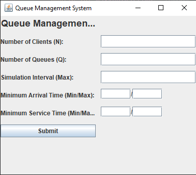

# Queue Management Application

## Descriere
Această aplicație simulează gestionarea cozilor pentru minimizarea timpului de așteptare al clienților.   Clienții sunt generați la începutul simulării și sunt adăugați în coada optimă în funcție de strategia selectată.   Aplicația măsoară timpul total petrecut în cozi și calculează timpul mediu de așteptare.

  
## Screenshot
  

  
## Fișiere de Test
Pentru validarea funcționalității aplicației, sunt folosite mai multe fișiere de test care conțin simulări diferite ale cozilor:  
### `test1.txt` `test2.txt` și `test3.txt`
- Aceste fișiere simulează un set de clienți care sosesc la momente diferite și sunt adăugați în cozi conform strategiei de alocare selectate.
- Fiecare linie reprezintă starea simulării la un moment dat, incluzând:
  - **Timpul curent** (`Time is X`)
  - **Clienții în așteptare** (`Waiting clients: (ID, Arrival Time, Service Time)`)
  - **Starea cozilor** (`Queue 0 : ...` și `Queue 1 : ...`)

  
## Funcționalități
- **Generarea unui număr `N` de clienți**, fiecare cu:
  - **ID** (între 1 și N)
  - **Timp de sosire** (momentul în care clientul intră în coadă)
  - **Timp de servire** (intervalul necesar pentru a fi servit)
- **Atribuirea clienților la cozi** folosind strategii diferite:
  - **ConcreteStrategyQueue** – alege coada cu cel mai mic număr de clienți.
  - **ConcreteStrategyTime** – alege coada cu cel mai mic timp de servire.
- **Gestionarea cozilor și a strategiei de alocare** cu ajutorul clasei `Scheduler`.
- **Simularea procesului de așteptare și servire** folosind `SimulationManager`.
- **Afișare în timp real** a stării cozilor prin `RealTimeQueue`.
- **Interfață grafică (GUI)** pentru configurarea simulării prin `SimulationFrame`.

## Structura Proiectului

### 1. **Strategii de Alocare**
- `ConcreteStrategyQueue` – atribuie sarcinile la coada cu cei mai puțini clienți.
- `ConcreteStrategyTime` – atribuie sarcinile la coada cu cel mai mic timp de servire.

### 2. **Gestionarea Cozilor**
- `Scheduler` – gestionează lista de servere și schimbă strategia de alocare a clienților.

### 3. **Simulare**
- `SimulationManager` – controlează fluxul simulării și gestionează timpul de sosire și servire.

### 4. **Interfață Grafică**
- `RealTimeQueue` – afișează outputul simulării în timp real.
- `SimulationFrame` – oferă interfața utilizatorului pentru introducerea parametrilor.

